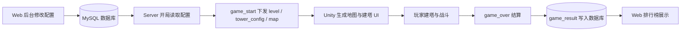
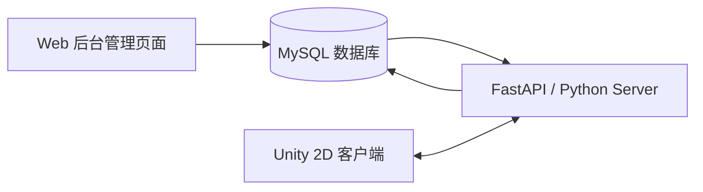
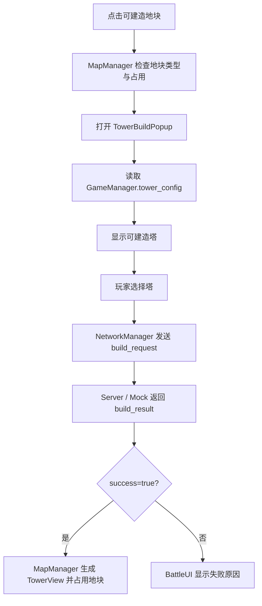
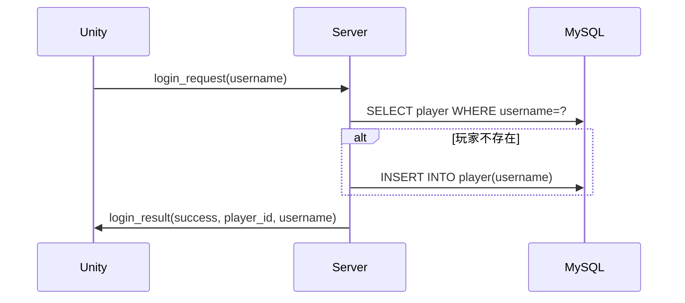
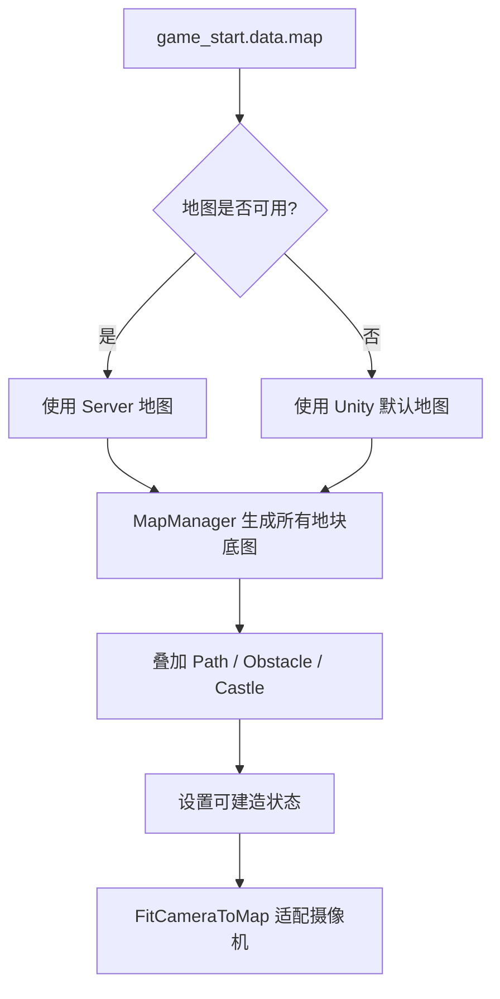
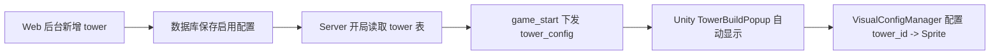
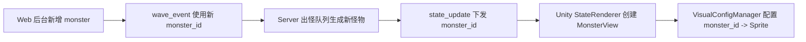

# 《绿野哨站》项目说明文档


# 1. 项目概述

## 1.1 基本信息

| 项目项 | 内容 |
|---|---|
| 项目名称 | 《绿野哨站》 |
| 项目类型 | 2D 塔防游戏 + Web 后台配置 + Server 权威逻辑 + 数据库存储 |
| 当前完成版本 | 单人 MVP Demo |
| Unity 项目位置 | `unity_client/` |
| Web 后台位置 | `web_admin/` |
| Server 位置 | `server/` |
| 数据库文件位置 | `database/schema.sql`、`database/seed_data.sql` |
| 协议与数据库文档 | `docs/json_protocol.md`、`docs/database_design.md` |

## 1.2 项目目标

《绿野哨站》的当前版本以“单人可演示闭环”为核心目标。玩家在 Unity 客户端中完成登录、进入大厅、开始战斗、点击地块建造防御塔、观察怪物沿路径移动、查看金币/分数/基地血量变化，并在胜利或失败后看到结算结果。

项目同时提供 Web 后台，用于维护防御塔、怪物、关卡、出怪事件、玩家和排行榜数据。Server 读取数据库配置，在游戏开始时向 Unity 下发关卡、塔和地图配置，并在游戏循环中负责出怪、怪物移动、塔攻击、金币得分更新、胜负判定和结算写库。数据库保存配置数据和游戏结果，Web 后台通过排行榜页面展示结算记录。

当前项目重点突出以下闭环：

```text
Web 后台配置
→ MySQL 数据库存储
→ Python / FastAPI Server 读取配置并运行逻辑
→ Unity 2D 客户端接收 JSON 状态并渲染
→ 游戏结束写入 game_result
→ Web 后台排行榜展示
```

## 1.3 单人 MVP 版本定位

《绿野哨站》从当前版本开始即按单人塔防 MVP 进行设计，核心目标是保证玩家能够独立完成一局完整游戏，并清晰展示 Unity、Web 后台、Server 和数据库之间的数据闭环。这样的定位适合结题演示，也便于后续持续扩展内容和关卡。

| 设计目标 | 说明 |
|---|---|
| 保证可运行闭环 | 单人流程能稳定展示登录、开局、建塔、怪物、结算、排行榜等完整功能。 |
| 突出数据联动 | 重点展示 Web 配置、Server 权威逻辑、Unity 渲染和数据库排行榜之间的联动关系。 |
| 降低演示复杂度 | 当前版本聚焦核心玩法与工程链路，避免额外系统分散演示重点。 |
| 便于后续扩展 | 当前协议保留 `player_id`、`owner_player_id`、`game_id` 等通用字段，便于继续扩展更多关卡、塔、怪物和玩法模式。 |

---

# 2. 最终提交成果对应说明

本节对应结题前需要提交的成果，说明当前仓库可以支撑哪些交付内容。

## 2.1 可运行的 Unity 项目

Unity 当前包含以下可演示内容：

| 功能 | 当前实现情况 | 关联文件 |
|---|---|---|
| 登录界面 | 输入昵称，点击登录；Mock 模式下可离线成功登录，真实模式下通过 WebSocket 发送 `login_request` | `unity_client/Assets/Scripts/UI/LoginUI.cs` |
| 大厅界面 | 显示玩家昵称和 `player_id`，点击开始游戏，发送 `start_game_request` | `unity_client/Assets/Scripts/UI/LobbyUI.cs` |
| 战斗场景 | 包含地图、UI 面板、怪物根节点、塔根节点、建塔弹窗、结算面板 | `unity_client/Assets/Scenes/BattleScene.unity` |
| 地图生成 | 根据 Server 下发 `map` 或 fallback 默认地图生成格子、路径、障碍和城堡 | `BattleMapConfig.cs`、`MapManager.cs` |
| 地块点击 | 可建造地块响应点击，不允许在路径、障碍、城堡和已占用地块建造 | `TileButton.cs`、`MapManager.cs` |
| 建塔选择 | 点击地块打开 `TowerBuildPopup`，显示可建造塔配置，并通过按钮选择塔 | `TowerSelectionUI.cs`、`TowerCardUI.cs` |
| 两种防御塔选择 | Mock 模式中内置基础塔和速射塔；真实 Server 模式中按数据库启用的 `tower` 配置下发 | `MockServerClient.cs`、`db.py` |
| 怪物移动 | 根据 `state_update.monsters[].x/y` 渲染怪物位置，Mock 模式内部也会驱动怪物移动 | `StateRenderer.cs`、`MonsterView.cs` |
| 塔攻击 | Mock 和真实 Server 都包含塔攻击逻辑；Unity 主要负责展示塔、攻击范围和怪物血条变化 | `MockServerClient.cs`、`game_logic.py`、`TowerView.cs` |
| 状态显示 | 显示金币、分数、基地血量、击杀数、时间 | `BattleUI.cs` |
| 胜利 / 失败结算 | 接收 `game_over` 后显示胜负、得分、击杀、用时、基地血量 | `ResultUI.cs` |
| Mock 模式 | 默认 `use_mock_server = true`，可脱离真实 Server 进行离线演示 | `NetworkManager.cs`、`MockServerClient.cs` |
| 真实 Server 模式 | 通过 `WebSocketClient` 连接 `server_url`，发送和接收 JSON over WebSocket | `NetworkManager.cs`、`WebSocketClient.cs` |

## 2.2 可运行的 Web 前端 / 后台页面


技术上使用 Vue 3、Vite、Vue Router、Element Plus、Axios。`vite.config.js` 将 `/api` 代理到 `http://127.0.0.1:8765`，因此本地开发时需要先运行 Server。

后台页面确认如下：

| 页面 | 路由 | 功能 | CRUD 情况 | 关联文件 |
|---|---|---|---|---|
| 仪表盘 | `/dashboard` | 展示塔、怪物、关卡、游戏记录数量，显示最近游戏记录 | 读取 | `web_admin/src/views/Dashboard.vue` |
| 防御塔配置 | `/towers` | 名称、造价、攻击力、范围、冷却、返还比例、描述、启用状态 | 新增、编辑、删除、启用/禁用 | `TowerManage.vue` |
| 怪物配置 | `/monsters` | 名称、血量、速度、得分、奖励金币、基地伤害、启用状态 | 新增、编辑、删除、启用/禁用 | `MonsterManage.vue` |
| 关卡配置 | `/levels` | 关卡名、初始金币、基地血量、每秒金币、描述、启用状态 | 新增、编辑、删除、启用/禁用 | `LevelManage.vue` |
| 出怪事件配置 | `/wave-events` | 按关卡维护波次、生成时间、怪物类型、数量、间隔、启用状态 | 新增、编辑、删除、启用/禁用 | `WaveEventManage.vue` |
| 玩家管理 | `/players` | 管理玩家昵称 | 新增、编辑、删除 | `PlayerManage.vue` |
| 排行榜 | `/leaderboard` | 展示对局 ID、玩家、关卡、分数、击杀、用时、胜负、时间 | 读取 | `Leaderboard.vue` |

注意：当前前端源码中的部分中文文本在终端读取时出现编码显示异常，但 API 字段和页面逻辑可确认；如果结题演示中出现页面文字乱码，建议在最终展示前统一检查并修复前端文件编码。

## 2.3 Unity 与 Web 端数据联动功能

当前实现的联动链路如下：



配置生效方式：

| 配置类型 | 当前生效方式 | 说明 |
|---|---|---|
| 防御塔配置 | 下一局生效 | Server 在 `start_game_request` 后读取启用的 `tower` 表记录，并通过 `game_start.data.tower_config` 下发。 |
| 怪物配置 | 下一局生效 | Server 在开局时读取启用的 `monster`，并结合 `wave_event` 生成出怪队列。 |
| 关卡配置 | 下一局生效 | Server 根据 `level_id` 读取 `level` 表，决定初始金币、基地血量和金币增长。 |
| 出怪事件配置 | 下一局生效 | Server 开局时读取当前关卡启用的 `wave_event`，生成 `spawn_queue`。 |
| 实时配置更新 | 当前未启用 | Unity `MessageTypes` 中有 `ConfigUpdate` 常量，但当前 Server 未实现对应 WebSocket 处理和推送。 |

## 2.4 全套工程源码与配置文件

仓库包含以下提交材料：

| 类型 | 路径 | 说明 |
|---|---|---|
| Unity 客户端 | `unity_client/` | Unity 2D 客户端工程，包括场景、脚本、Prefab、资源和项目配置 |
| Server 端 | `server/` | FastAPI HTTP API + WebSocket 游戏服务 |
| Web 后台 | `web_admin/` | Vue 3 管理后台 |
| 数据库 SQL | `database/` | 建表脚本和初始配置数据 |
| 协议文档 | `docs/json_protocol.md` | JSON over WebSocket 协议说明 |
| 数据库文档 | `docs/database_design.md` | 数据库设计说明 |
| Git 忽略规则 | `.gitignore`、`unity_client/.gitignore` | 忽略 Unity/Node/Python 生成物，保留源码和配置 |
| 美术/UI 待办 | `unity_client/Assets/ART_UI_TODO.md` | Sprite、UI、Inspector 配置交接清单 |

## 2.5 项目说明文档

本文档即最终项目说明文档，覆盖：

- 项目背景与目标
- 总体架构
- 技术栈
- Unity 客户端设计
- Web 后台设计
- Server 游戏逻辑设计
- 数据库设计
- 通信协议设计
- 地图与坐标系统
- 多塔与多怪扩展方案
- 当前完成功能
- 运行方式
- 演示流程
- 测试与验收
- 项目亮点
- 后续扩展方向
- PPT 制作建议和演示视频脚本

## 2.6 项目演示视频 + 最终汇报 PPT

建议演示视频控制在 3 到 5 分钟，重点展示“可运行闭环”：

| 时间段 | 展示内容 |
|---|---|
| 0:00 - 0:30 | 项目简介、整体架构图、四端关系 |
| 0:30 - 1:20 | Web 后台配置防御塔、怪物、关卡和出怪事件 |
| 1:20 - 2:40 | Unity 登录、大厅、进入战斗、地图生成、建塔弹窗、多塔选择 |
| 2:40 - 3:30 | 怪物沿路径移动、塔攻击、金币/分数/基地血量变化 |
| 3:30 - 4:20 | 结算界面、Server 写入结果、Web 排行榜显示 |
| 4:20 - 5:00 | 总结亮点、说明 Mock 模式和后续扩展 |

PPT 建议结构见本文档末尾“附录：PPT 制作建议”。

---

# 3. 系统总体架构

## 3.1 四端关系

| 模块 | 作用 | 输入 | 输出 | 关联文件 |
|---|---|---|---|---|
| Unity Client | 负责画面显示、玩家输入、建塔操作、状态渲染、结算展示 | WebSocket 消息、玩家点击输入 | `login_request`、`start_game_request`、`build_request`，以及画面渲染 | `unity_client/Assets/Scripts/` |
| Server | 负责 WebSocket 通信、HTTP API、游戏逻辑、配置读取、状态推送、结算写库 | Unity 请求、Web 后台 HTTP 请求、数据库配置 | `game_start`、`state_update`、`build_result`、`game_over`、HTTP JSON | `server/` |
| Web Admin | 负责后台配置、玩家管理、排行榜展示 | 管理员表单输入、HTTP API 数据 | 配置写库、排行榜页面 | `web_admin/` |
| Database | 保存玩家、塔、怪物、关卡、出怪事件、游戏结果 | Server 和 Web API 的读写 | 配置数据、排行榜数据 | `database/schema.sql` |

## 3.2 架构图



## 3.3 数据流说明

管理员在 Web 后台维护游戏配置，Web 后台通过 Axios 调用 Server 的 `/api` 接口，Server 将配置写入 MySQL。玩家从 Unity 登录并开始游戏时，Unity 通过 WebSocket 发送 `start_game_request`，Server 读取数据库中的关卡、塔、怪物和出怪事件配置，生成本局 `GameState`，再通过 `game_start` 下发初始配置。之后 Server 按固定 tick 推进游戏逻辑，通过 `state_update` 将怪物、塔、玩家金币、分数、基地血量等状态同步给 Unity。玩家点击地块建塔时，Unity 发送 `build_request`，Server 判断金币、塔类型和地块占用情况，再返回 `build_result`。游戏结束后 Server 发送 `game_over`，并将结果写入 `game_result` 表，Web 后台排行榜读取该表展示成绩。

---

# 4. 技术栈

| 模块 | 技术 | 依据 |
|---|---|---|
| Unity 客户端 | Unity 2022.3.62f3c1、Unity 2D、C#、UGUI、TextMeshPro、Newtonsoft JSON、`ClientWebSocket` | `ProjectVersion.txt`、`manifest.json`、`WebSocketClient.cs` |
| Server | Python、FastAPI、Uvicorn、PyMySQL、WebSocket | `server/requirements.txt`、`main.py`、`http_api.py` |
| Web 后台 | Vue 3、Vite、Vue Router、Element Plus、Axios | `web_admin/package.json` |
| 数据库 | MySQL | `database/schema.sql`、`server/config.py` |
| 通信协议 | JSON over WebSocket；HTTP JSON API | `docs/json_protocol.md`、`wss_handler.py`、`http_api.py` |
| 版本管理 | Git、`.gitignore`；README 中未记录远程平台，GitHub/SourceTree 使用情况待确认 | `.git/`、`.gitignore` |

---

# 5. Unity 客户端设计

Unity 客户端位于 `unity_client/`，核心脚本集中在：

```text
unity_client/Assets/Scripts/
```

目录结构：

```text
Assets/Scripts/
├── GameManager.cs
├── Network/
│   ├── NetworkManager.cs
│   ├── MockServerClient.cs
│   ├── WebSocketClient.cs
│   ├── JsonModels.cs
│   └── MessageTypes.cs
├── Battle/
│   ├── BattleMapConfig.cs
│   ├── MapManager.cs
│   ├── StateRenderer.cs
│   ├── TileButton.cs
│   ├── TowerView.cs
│   ├── MonsterView.cs
│   └── VisualConfigManager.cs
└── UI/
    ├── LoginUI.cs
    ├── LobbyUI.cs
    ├── BattleUI.cs
    ├── TowerSelectionUI.cs
    ├── TowerCardUI.cs
    └── ResultUI.cs
```

## 5.1 场景设计

| 场景 | 作用 | 输入 | 输出 | 关联文件 |
|---|---|---|---|---|
| `LoginScene` | 登录入口，输入昵称，触发 Mock 或真实 Server 登录 | 玩家昵称、登录按钮 | `login_request`，登录成功后加载大厅 | `LoginUI.cs` |
| `LobbyScene` | 展示玩家信息，开始游戏 | `GameManager` 中的登录状态、开始按钮 | `start_game_request`，收到 `game_start` 后加载战斗场景 | `LobbyUI.cs` |
| `BattleScene` | 战斗主场景，显示地图、建塔、怪物、UI 和结算 | `game_start` 配置、`state_update` 状态、玩家点击 | 地图渲染、建塔请求、状态显示、结算面板 | `MapManager.cs`、`BattleUI.cs`、`ResultUI.cs` |

## 5.2 核心管理类

### GameManager

| 项目 | 内容 |
|---|---|
| 文件 | `unity_client/Assets/Scripts/GameManager.cs` |
| 作用 | 跨场景保存玩家、本局游戏状态和配置数据 |
| 输入 | `login_result`、`game_start`、`state_update`、`game_over` |
| 输出 | 为 UI、地图、建塔弹窗和渲染模块提供玩家状态、塔配置、地图配置 |
| 关键字段 | `username`、`player_id`、`game_id`、`gold`、`score`、`kill_count`、`base_hp`、`tower_config`、`current_map_config` |

`GameManager` 使用单例和 `DontDestroyOnLoad`，保证从登录场景切换到大厅、战斗场景时玩家状态不丢失。`SetGameStart` 保存 Server 下发的塔配置和地图配置，若地图不可用，后续由 `BattleMapConfig` 使用 fallback 默认地图。

### NetworkManager

| 项目 | 内容 |
|---|---|
| 文件 | `unity_client/Assets/Scripts/Network/NetworkManager.cs` |
| 作用 | 统一网络入口，屏蔽 Mock 模式和真实 WebSocket 模式差异 |
| 输入 | UI 调用：登录、开始游戏、建塔 |
| 输出 | `OnLoginResult`、`OnGameStart`、`OnBuildResult`、`OnStateUpdate`、`OnGameOver` 事件 |
| 关键字段 | `use_mock_server`、`server_url`、`IsLoggedIn`、`IsConnected` |

默认 `use_mock_server = true`。在 Mock 模式下不连接真实 Server，而是直接调用 `MockServerClient`；在真实模式下通过 `WebSocketClient` 连接 `server_url`，当前默认地址为 `ws://192.168.221.81:8765/ws`，实际演示时应根据本机或服务器 IP 修改。

### MockServerClient

| 项目 | 内容 |
|---|---|
| 文件 | `unity_client/Assets/Scripts/Network/MockServerClient.cs` |
| 作用 | 离线演示和测试用的本地模拟 Server |
| 输入 | `login_request`、`start_game_request`、`build_request` |
| 输出 | 模拟 `login_result`、`game_start`、`state_update`、`build_result`、`game_over` |
| 当前完成 | 登录、开局、两种塔、两种怪、怪物移动、塔攻击、金币/分数/击杀、基地扣血、胜负结算 |

Mock 模式的优势是：即使真实 Server 或数据库未启动，也能演示 Unity 核心玩法。Mock 模式下内置两种塔：基础塔和速射塔；内置普通怪和重型怪，并根据时间逐步增强。

### WebSocketClient

| 项目 | 内容 |
|---|---|
| 文件 | `unity_client/Assets/Scripts/Network/WebSocketClient.cs` |
| 作用 | 真实 Server 模式下的 WebSocket 客户端 |
| 输入 | WebSocket URL、待发送 JSON 字符串 |
| 输出 | 连接、关闭、消息、错误事件 |
| 实现方式 | `System.Net.WebSockets.ClientWebSocket` |

`WebSocketClient` 负责连接、收发、消息队列、主线程派发事件。`NetworkManager` 负责协议解析和分发。

### JsonModels

| 项目 | 内容 |
|---|---|
| 文件 | `unity_client/Assets/Scripts/Network/JsonModels.cs` |
| 作用 | 定义 Unity 端 JSON 协议数据结构 |
| 输入 | Server / Mock 返回 JSON |
| 输出 | C# 强类型对象 |
| 关键模型 | `ProtocolMessage<TData>`、`GameStartData`、`MapConfigData`、`TowerConfigData`、`StateUpdateData`、`GameOverData` |

### MessageTypes

| 项目 | 内容 |
|---|---|
| 文件 | `unity_client/Assets/Scripts/Network/MessageTypes.cs` |
| 作用 | 集中定义消息类型字符串 |
| 当前消息 | `login_request`、`login_result`、`start_game_request`、`game_start`、`state_update`、`build_request`、`build_result`、`game_over`、`error` |
| 预留消息 | `config_update` 已在 Unity 常量中存在，但当前 Server 未实现对应处理 |

## 5.3 战斗模块

### BattleMapConfig

| 项目 | 内容 |
|---|---|
| 文件 | `unity_client/Assets/Scripts/Battle/BattleMapConfig.cs` |
| 作用 | 管理地图默认配置、Server 地图 fallback、grid 到 world 坐标转换 |
| 输入 | `GameManager.current_map_config` 或默认地图 |
| 输出 | 地图宽高、路径、障碍、城堡、世界坐标 |

默认地图为 14 × 8，`CellSize = 0.8f`。如果 `game_start.data.map` 可用，则使用 Server 地图；否则使用默认地图。

### MapManager

| 项目 | 内容 |
|---|---|
| 文件 | `unity_client/Assets/Scripts/Battle/MapManager.cs` |
| 作用 | 生成战斗地图、处理地块点击、建塔成功后生成塔对象 |
| 输入 | 地图配置、鼠标点击、`build_result` |
| 输出 | 地图格子、路径/障碍/城堡覆盖物、TowerView 实例 |

`MapManager` 会为每个格子生成底图，再根据地图配置创建路径、障碍和城堡覆盖物。点击可建造地块时，它打开 `TowerSelectionUI`；收到 `build_result.success = true` 后，它根据 `TowerStateData` 在对应格子创建塔并标记地块已占用。

### TileButton

| 项目 | 内容 |
|---|---|
| 文件 | `unity_client/Assets/Scripts/Battle/TileButton.cs` |
| 作用 | 表示单个地图格子，处理点击、悬停和是否可建造 |
| 输入 | 鼠标点击、格子类型 |
| 输出 | 调用 `MapManager.OnTileClicked(grid_x, grid_y)` |

`TileButton` 会阻止路径、障碍、城堡、已占用地块的建塔操作，并将提示交给 `MapManager` / `BattleUI`。

### StateRenderer

| 项目 | 内容 |
|---|---|
| 文件 | `unity_client/Assets/Scripts/Battle/StateRenderer.cs` |
| 作用 | 根据 `state_update` 创建、更新、删除怪物显示 |
| 输入 | `StateUpdateData.monsters`、`base_hp`、玩家状态 |
| 输出 | 怪物对象位置、血条、UI 状态刷新 |

`StateRenderer` 使用 `instance_id` 追踪怪物。若某只怪物在最新 `state_update` 中不存在，则销毁对应显示对象。

### TowerView

| 项目 | 内容 |
|---|---|
| 文件 | `unity_client/Assets/Scripts/Battle/TowerView.cs` |
| 作用 | 显示防御塔 Sprite 和攻击范围 |
| 输入 | `tower_id`、`grid_x`、`grid_y`、`GameManager.tower_config` |
| 输出 | 塔图像、范围圆形 LineRenderer |

攻击范围来自 `TowerConfigData.range`，显示半径按 `range * BattleMapConfig.CellSize` 转换。

### MonsterView

| 项目 | 内容 |
|---|---|
| 文件 | `unity_client/Assets/Scripts/Battle/MonsterView.cs` |
| 作用 | 显示怪物、移动插值、血条、简单帧动画 |
| 输入 | `MonsterStateData` |
| 输出 | 怪物位置、血条比例、Sprite/动画帧 |

`MonsterView` 支持按 `monster_id` 选择不同 Sprite 或动画帧，未配置时使用 fallback Sprite 和颜色。

### VisualConfigManager

| 项目 | 内容 |
|---|---|
| 文件 | `unity_client/Assets/Scripts/Battle/VisualConfigManager.cs` |
| 作用 | 管理 `tower_id -> Sprite` 和 `monster_id -> Sprite` 映射 |
| 输入 | Inspector 配置的 Sprite 列表 |
| 输出 | 塔和怪物显示资源 |

该脚本支持后续新增塔和怪物时只配置 Sprite 映射，不需要改核心渲染逻辑。

## 5.4 UI 模块

| UI 脚本 | 作用 | 输入 | 输出 |
|---|---|---|---|
| `LoginUI.cs` | 昵称输入、登录按钮、状态提示 | 玩家昵称、`login_result` | 登录请求、跳转大厅 |
| `LobbyUI.cs` | 玩家信息展示、开始游戏 | `GameManager` 登录状态、`game_start` | 开始游戏请求、跳转战斗 |
| `BattleUI.cs` | 战斗状态栏 | `GameManager` 和 `state_update` | 金币、分数、基地血量、击杀数、时间、消息 |
| `TowerSelectionUI.cs` | 建塔弹窗 | 被点击的地块、`tower_config`、玩家金币 | `build_request` |
| `TowerCardUI.cs` | 塔配置卡片 | 单个 `TowerConfigData`、当前金币 | 塔名称、造价、攻击、范围、冷却显示 |
| `ResultUI.cs` | 结算面板 | `game_over` | 胜负、得分、击杀、用时、基地血量 |

当前建塔交互流程：



---

# 6. Web 后台设计

Web 后台目录：

```text
web_admin/
```

关键文件：

| 文件 | 作用 |
|---|---|
| `web_admin/package.json` | 前端依赖和启动脚本 |
| `web_admin/vite.config.js` | Vite 配置，代理 `/api` 到 Server |
| `web_admin/src/api/index.js` | Axios 实例和错误处理 |
| `web_admin/src/router/index.js` | 页面路由 |
| `web_admin/src/components/Layout.vue` | 后台整体布局和侧边栏 |
| `web_admin/src/views/*.vue` | 具体管理页面 |

## 6.1 防御塔配置

| 字段 | 含义 | 数据来源 |
|---|---|---|
| `tower_id` | 防御塔 ID | 数据库自增 |
| `name` | 防御塔名称 | 管理员录入 |
| `cost` | 建造造价 | 管理员录入 |
| `attack` | 攻击力 | 管理员录入 |
| `range_value` | 攻击范围，Server 下发给 Unity 时映射为 `range` | 管理员录入 |
| `cooldown` | 攻击冷却，单位秒 | 管理员录入 |
| `refund_rate` | 返还比例，当前出售功能未启用，字段保留 | 管理员录入 |
| `description` | 描述 | 管理员录入 |
| `is_active` | 是否启用 | 开关控制 |

关联文件：

- 前端：`web_admin/src/views/TowerManage.vue`
- API：`server/http_api.py`
- 数据表：`tower`

## 6.2 怪物配置

| 字段 | 含义 | 数据来源 |
|---|---|---|
| `monster_id` | 怪物 ID | 数据库自增 |
| `name` | 怪物名称 | 管理员录入 |
| `hp` | 最大血量 | 管理员录入 |
| `speed` | 移动速度 | 管理员录入 |
| `score_value` | 击杀得分 | 管理员录入 |
| `reward_gold` | 击杀奖励金币 | 管理员录入 |
| `damage_to_base` | 到达终点扣除基地血量 | 管理员录入 |
| `is_active` | 是否启用 | 开关控制 |

关联文件：

- 前端：`web_admin/src/views/MonsterManage.vue`
- API：`server/http_api.py`
- 数据表：`monster`

## 6.3 关卡配置

| 字段 | 含义 | 数据来源 |
|---|---|---|
| `level_id` | 关卡 ID | 数据库自增 |
| `level_name` | 关卡名称 | 管理员录入 |
| `initial_gold` | 初始金币 | 管理员录入 |
| `base_hp` | 基地初始血量 | 管理员录入 |
| `gold_per_second` | 每秒金币增长 | 管理员录入 |
| `description` | 关卡说明 | 管理员录入 |
| `is_active` | 是否启用 | 开关控制 |

关联文件：

- 前端：`web_admin/src/views/LevelManage.vue`
- API：`server/http_api.py`
- 数据表：`level`

## 6.4 出怪事件配置

| 字段 | 含义 | 数据来源 |
|---|---|---|
| `event_id` | 出怪事件 ID | 数据库自增 |
| `level_id` | 所属关卡 | 关卡下拉选择 |
| `wave_number` | 波次编号 | 管理员录入 |
| `spawn_time` | 游戏开始后第几秒触发 | 管理员录入 |
| `monster_id` | 怪物类型 | 怪物下拉选择 |
| `count` | 生成数量 | 管理员录入 |
| `interval_time` | 多只怪之间生成间隔 | 管理员录入 |
| `is_active` | 是否启用 | 开关控制 |

关联文件：

- 前端：`web_admin/src/views/WaveEventManage.vue`
- API：`server/http_api.py`
- 数据表：`wave_event`

## 6.5 排行榜

| 字段 | 含义 | 数据来源 |
|---|---|---|
| `result_id` | 结果记录 ID | `game_result` 自增 |
| `game_id` | 对局 ID | Server 生成 |
| `username` | 玩家昵称 | 登录信息 |
| `level_id` | 关卡 ID | 本局配置 |
| `score` | 得分 | Server 游戏逻辑 |
| `kill_count` | 击杀数 | Server 游戏逻辑 |
| `time_used` | 用时，单位秒 | Server 游戏逻辑 |
| `is_win` | 胜负结果 | Server 判定 |
| `played_at` | 游玩时间 | 数据库默认时间 |

关联文件：

- 前端：`web_admin/src/views/Leaderboard.vue`
- API：`server/http_api.py` 的 `/api/leaderboard`
- 数据表：`game_result`

---

# 7. Server 游戏逻辑设计

Server 目录：

```text
server/
├── main.py
├── config.py
├── db.py
├── game_logic.py
├── http_api.py
├── models.py
├── result_writer.py
├── wss_handler.py
└── requirements.txt
```

## 7.1 Server 模块职责

| 文件 | 作用 | 输入 | 输出 |
|---|---|---|---|
| `main.py` | 创建 FastAPI 应用，挂载 HTTP API 和 `/ws` WebSocket | HTTP / WebSocket 请求 | API 响应、WebSocket 消息 |
| `config.py` | Server 端口、数据库连接、地图配置、tick 间隔 | 配置常量 | 被其他模块引用 |
| `db.py` | 数据库读写 | SQL 请求参数 | 玩家、配置、排行榜、写入结果 |
| `models.py` | 运行时模型 | 配置数据 | `Player`、`Monster`、`Tower`、`GameState` 对象 |
| `game_logic.py` | 核心游戏逻辑 | 本局状态、出怪队列、建塔请求 | `state_update`、`game_over` |
| `wss_handler.py` | WebSocket 协议处理 | Unity JSON 消息 | `login_result`、`game_start`、`build_result` 等 |
| `http_api.py` | Web 后台 HTTP API | 后台 CRUD 请求 | 表数据、排行榜 |
| `result_writer.py` | 游戏结束写库 | `GameState` 和结算结果 | `game_result` 记录 |

## 7.2 登录流程



关键实现：

- `wss_handler.py` 处理 `login_request`
- `db.py/get_or_create_player` 查询或创建玩家
- 登录只使用昵称，无密码系统；复杂账号系统为后续扩展方向

## 7.3 开始游戏流程

Unity 发送 `start_game_request` 后，Server 会：

1. 校验 `player_id` 是否已登录。
2. 读取 `level_id`，默认 1。
3. 生成随机 `game_id`。
4. 调用 `init_game` 加载数据库配置。
5. 向 Unity 发送 `game_start`，包含关卡、玩家、塔配置、地图和基地血量。
6. 创建异步任务 `_run_game_for_player`，开始游戏循环。

关键文件：

- `server/wss_handler.py`
- `server/game_logic.py`
- `server/db.py`

## 7.4 加载配置流程

`db.py/load_level_config(level_id)` 会读取：

| 配置 | SQL 条件 |
|---|---|
| 关卡 | `SELECT * FROM level WHERE level_id = %s AND is_active = 1` |
| 防御塔 | `SELECT tower_id, name, cost, attack, range_value, cooldown, refund_rate FROM tower WHERE is_active = 1` |
| 怪物 | `SELECT * FROM monster WHERE is_active = 1` |
| 出怪事件 | 根据 `level_id` 查询启用的 `wave_event`，并 JOIN `monster` |

配置在开局时读取，因此 Web 后台修改配置后，当前实现为“下一局生效”。

## 7.5 地图配置下发

当前 Server 地图来自 `server/config.py` 的 `MAP_CONFIG`，而不是数据库表。`game_start.data.map` 会下发：

- `map_id`
- `name`
- `width`
- `height`
- `path_points`
- `obstacles`
- `castle`

Unity 接收后由 `BattleMapConfig` 和 `MapManager` 生成显示地图。

## 7.6 出怪逻辑

`init_game` 根据 `wave_event` 将每个事件展开为具体出怪队列：

```text
spawn_time + i * interval_time
```

每只怪物保存：

- `monster_id`
- `name`
- `hp` / `max_hp`
- `speed`
- `reward_gold`
- `score_value`
- `damage_to_base`
- 初始路径点位置

游戏循环中，当 `game_state.time_elapsed` 达到出怪时间，怪物被设置为存活并加入 `game_state.monsters`。

## 7.7 怪物移动逻辑

怪物沿 `MAP_CONFIG.path_points` 移动。`Monster.advance(path_points, tick_interval)` 使用路径点之间的线性插值推进 `x/y`。Server 发送的是浮点 grid 坐标，不发送 Unity 世界坐标。

当怪物到达路径最后一个点：

1. 扣除 `base_hp`，扣除值为 `damage_to_base`。
2. 怪物标记为不存活。
3. 后续被清理出怪物列表。

## 7.8 建塔请求处理

Unity 发送：

```json
{
  "type": "build_request",
  "data": {
    "tower_id": 1,
    "grid_x": 3,
    "grid_y": 5
  }
}
```

Server 在 `build_tower` 中判断：

| 判断项 | 失败原因 |
|---|---|
| 玩家不存在 | `invalid_player` |
| 塔类型不存在 | `invalid_tower` |
| 地块已占用 | `tile_occupied` |
| 金币不足 | `not_enough_gold` |

成功时：

1. 扣除玩家金币。
2. 标记地块占用。
3. 创建 `Tower` 实例。
4. 返回 `build_result.success = true` 和塔实例信息。

当前真实 Server 只判断服务端记录的占用和金币，不校验地块是否为路径、障碍或城堡；Unity 端会先阻止不可建造地块。更严格的服务端地图合法性校验可作为后续增强。

## 7.9 塔攻击逻辑

每次 tick 中，Server 遍历所有塔：

1. 若塔冷却未结束，减少 `cooldown_timer`。
2. 若冷却结束，查找范围内第一只存活怪物。
3. 对怪物扣血。
4. 重置塔冷却。
5. 怪物死亡时给建塔玩家增加金币、分数和击杀数。

攻击范围使用 grid 单位，判断方式为塔格子坐标与怪物浮点 grid 坐标的欧氏距离。

## 7.10 金币、分数、击杀数更新

金币来源：

- 关卡配置中的 `gold_per_second` 随时间增长。
- 击杀怪物获得 `reward_gold`。

分数来源：

- 击杀怪物获得 `score_value`。

击杀数：

- 怪物被塔击杀时 `kill_count += 1`。

## 7.11 胜利 / 失败判定

| 结果 | 判定条件 |
|---|---|
| 失败 | `base_hp <= 0` |
| 胜利 | 出怪队列为空，场上无存活怪物，且游戏已开始运行 |

达到结算条件时，Server 发送 `game_over`，并通过 `result_writer.py` 写入数据库。

## 7.12 Mock 模式与真实 Server 模式对比

| 功能 | Mock 模式 | 真实 Server 模式 |
|---|---|---|
| 登录 | 已完成，本地模拟 | 已完成，写入/读取 `player` 表 |
| 开局 | 已完成，本地内置配置 | 已完成，读取数据库和 `MAP_CONFIG` |
| 两种塔 | 已完成，内置两种塔 | 支持多塔，具体数量取决于数据库启用记录；种子数据当前只有一塔 |
| 两种怪 | 已完成，内置普通怪和重型怪 | 支持多怪，具体数量取决于数据库启用记录和出怪事件|
| 怪物移动 | 已完成 | 已完成 |
| 塔攻击 | 已完成 | 已完成 |
| 结算 UI | 已完成 | 已完成 |
| 写入数据库 | Mock 不写库 | 已完成 |
| 排行榜联动 | Mock 不直接联动 Web 排行榜 | 已完成 |
| 实时配置更新 | 当前未启用 | 当前未启用 |

---

# 8. 数据库设计

数据库脚本位于：

```text
database/schema.sql
database/seed_data.sql
```

数据库名在 `server/config.py` 中配置为：

```text
cooperative_defense
```

## 8.1 player 玩家表

用途：保存玩家基础信息。当前登录方式为昵称登录，若昵称不存在则自动创建。

| 字段 | 类型 | 用途 |
|---|---|---|
| `player_id` | `INT AUTO_INCREMENT PRIMARY KEY` | 玩家主键 |
| `username` | `VARCHAR(50) NOT NULL UNIQUE` | 玩家昵称，唯一 |
| `created_at` | `DATETIME DEFAULT CURRENT_TIMESTAMP` | 创建时间 |

## 8.2 tower 防御塔配置表

用途：保存可配置的防御塔参数，Server 开局时读取启用记录并下发给 Unity。

| 字段 | 类型 | 用途 |
|---|---|---|
| `tower_id` | `INT AUTO_INCREMENT PRIMARY KEY` | 防御塔类型 ID |
| `name` | `VARCHAR(50) NOT NULL` | 防御塔名称 |
| `cost` | `INT NOT NULL` | 建造消耗金币 |
| `attack` | `INT NOT NULL` | 攻击力 |
| `range_value` | `FLOAT NOT NULL` | 攻击范围，数据库字段名 |
| `cooldown` | `FLOAT NOT NULL DEFAULT 1.0` | 攻击冷却，单位秒 |
| `refund_rate` | `FLOAT NOT NULL DEFAULT 0.5` | 返还比例，当前出售功能未启用 |
| `description` | `VARCHAR(255)` | 描述 |
| `is_active` | `TINYINT(1) NOT NULL DEFAULT 1` | 是否启用 |

说明：数据库字段 `range_value` 在 Server 下发给 Unity 时映射为 JSON 字段 `range`，对应 `TowerConfigData.range`。

## 8.3 monster 怪物配置表

用途：保存怪物属性，出怪事件引用 `monster_id`。

| 字段 | 类型 | 用途 |
|---|---|---|
| `monster_id` | `INT AUTO_INCREMENT PRIMARY KEY` | 怪物类型 ID |
| `name` | `VARCHAR(50) NOT NULL` | 怪物名称 |
| `hp` | `INT NOT NULL` | 最大血量 |
| `speed` | `FLOAT NOT NULL` | 移动速度 |
| `score_value` | `INT NOT NULL DEFAULT 100` | 击杀得分 |
| `reward_gold` | `INT NOT NULL DEFAULT 10` | 击杀奖励金币 |
| `damage_to_base` | `INT NOT NULL DEFAULT 1` | 到达终点对基地造成的伤害 |
| `is_active` | `TINYINT(1) NOT NULL DEFAULT 1` | 是否启用 |

## 8.4 level 关卡表

用途：保存关卡基础规则。

| 字段 | 类型 | 用途 |
|---|---|---|
| `level_id` | `INT AUTO_INCREMENT PRIMARY KEY` | 关卡 ID |
| `level_name` | `VARCHAR(50) NOT NULL` | 关卡名称 |
| `initial_gold` | `INT NOT NULL DEFAULT 100` | 初始金币 |
| `base_hp` | `INT NOT NULL DEFAULT 10` | 基地初始血量 |
| `gold_per_second` | `FLOAT NOT NULL DEFAULT 1` | 每秒金币增长 |
| `description` | `VARCHAR(255)` | 关卡描述 |
| `is_active` | `TINYINT(1) NOT NULL DEFAULT 1` | 是否启用 |

## 8.5 wave_event 出怪事件表

用途：按关卡配置怪物生成时间线。

| 字段 | 类型 | 用途 |
|---|---|---|
| `event_id` | `INT AUTO_INCREMENT PRIMARY KEY` | 出怪事件 ID |
| `level_id` | `INT NOT NULL` | 所属关卡，外键到 `level` |
| `wave_number` | `INT NOT NULL DEFAULT 1` | 波次编号 |
| `spawn_time` | `FLOAT NOT NULL` | 游戏开始后第几秒触发 |
| `monster_id` | `INT NOT NULL` | 怪物类型，外键到 `monster` |
| `count` | `INT NOT NULL DEFAULT 1` | 生成数量 |
| `interval_time` | `FLOAT NOT NULL DEFAULT 0.5` | 多只怪之间生成间隔 |
| `is_active` | `TINYINT(1) NOT NULL DEFAULT 1` | 是否启用 |

## 8.6 game_result 游戏结果表

用途：保存每局游戏结算结果，Web 排行榜读取该表。

| 字段 | 类型 | 用途 |
|---|---|---|
| `result_id` | `INT AUTO_INCREMENT PRIMARY KEY` | 结果记录 ID |
| `game_id` | `VARCHAR(36)` | 本局游戏 ID |
| `username` | `VARCHAR(50) NOT NULL` | 玩家昵称 |
| `level_id` | `INT NOT NULL DEFAULT 1` | 关卡 ID |
| `score` | `INT NOT NULL DEFAULT 0` | 本局得分 |
| `kill_count` | `INT NOT NULL DEFAULT 0` | 击杀数 |
| `time_used` | `INT NOT NULL DEFAULT 0` | 本局用时，单位秒 |
| `is_win` | `TINYINT(1) NOT NULL DEFAULT 0` | 是否胜利，1 为胜利，0 为失败 |
| `played_at` | `DATETIME DEFAULT CURRENT_TIMESTAMP` | 游玩时间 |

## 8.7 初始数据

`database/seed_data.sql` 当前包含：

| 类型 | 初始内容 |
|---|---|
| 关卡 | 1 个测试关卡，初始金币 300，基地血量 100，每秒金币 1 |
| 防御塔 | 1 个基础塔，造价 100，攻击 10，范围 3，冷却 1 秒 |
| 怪物 | 1 个普通怪，血量 50，速度 1.5，击杀得分 20，奖励金币 10 |
| 出怪事件 | 3 组事件：第 5 秒 3 只、第 15 秒 5 只、第 30 秒 4 只 |


---

# 9. 通信协议设计

当前通信协议采用 JSON over WebSocket。通用消息格式如下：

```json
{
  "type": "消息类型",
  "request_id": "req_001",
  "game_id": 10001,
  "player_id": 1,
  "timestamp": 1716200000000,
  "data": {}
}
```

## 9.1 消息类型

| 消息类型 | 方向 | 当前实现情况 | 作用 |
|---|---|---|---|
| `login_request` | Unity → Server | 已实现 | 登录请求 |
| `login_result` | Server → Unity | 已实现 | 登录结果 |
| `start_game_request` | Unity → Server | 已实现 | 开始游戏 |
| `game_start` | Server → Unity | 已实现 | 下发关卡、玩家、塔配置、地图 |
| `build_request` | Unity → Server | 已实现 | 建塔请求 |
| `build_result` | Server → Unity | 已实现 | 建塔结果 |
| `state_update` | Server → Unity | 已实现 | 状态同步 |
| `game_over` | Server → Unity | 已实现 | 游戏结算 |
| `error` | Server → Unity | 已实现 | 错误消息 |
| `config_update` | Server → Unity | 已预留 / 当前未启用 | Unity 常量中存在，Server 未见完整处理逻辑 |

## 9.2 login_request / login_result

请求：

```json
{
  "type": "login_request",
  "request_id": "req_001",
  "timestamp": 1716200000000,
  "data": {
    "username": "Player"
  }
}
```

响应：

```json
{
  "type": "login_result",
  "request_id": "req_001",
  "timestamp": 1716200000100,
  "data": {
    "success": true,
    "player_id": 1,
    "username": "Player",
    "message": "login success"
  }
}
```

## 9.3 start_game_request / game_start

请求：

```json
{
  "type": "start_game_request",
  "request_id": "req_002",
  "player_id": 1,
  "timestamp": 1716200003000,
  "data": {
    "level_id": 1
  }
}
```

响应中的核心数据：

| 字段 | 说明 |
|---|---|
| `level` | 关卡 ID、名称、基地血量、初始金币、每秒金币 |
| `player` | 玩家 ID、昵称、金币、得分、击杀数 |
| `tower_config` | 启用防御塔配置列表，支持多塔 |
| `map` | 地图宽高、路径、障碍、城堡 |
| `base_hp` | 基地初始血量 |

## 9.4 build_request / build_result

请求：

```json
{
  "type": "build_request",
  "request_id": "req_003",
  "game_id": 10001,
  "player_id": 1,
  "timestamp": 1716200005000,
  "data": {
    "tower_id": 1,
    "grid_x": 3,
    "grid_y": 5
  }
}
```

成功响应：

```json
{
  "type": "build_result",
  "request_id": "req_003",
  "game_id": 10001,
  "player_id": 1,
  "timestamp": 1716200005100,
  "data": {
    "success": true,
    "reason": "",
    "tower": {
      "instance_id": "tower_10001_1",
      "tower_id": 1,
      "owner_player_id": 1,
      "grid_x": 3,
      "grid_y": 5
    },
    "player": {
      "player_id": 1,
      "gold": 200,
      "score": 0,
      "kill_count": 0
    }
  }
}
```

失败原因：

| reason | 含义 |
|---|---|
| `not_enough_gold` | 金币不足 |
| `tile_occupied` | 地块已占用 |
| `invalid_tower` | 无效塔类型 |
| `invalid_player` | 无效玩家 |
| `game_not_started` | 游戏未开始，通常通过 `error` 消息返回 |

## 9.5 state_update

`state_update` 是战斗过程中的核心同步消息。Server 端 `STATE_SYNC_INTERVAL = 0.125`，设计上约每秒 8 次状态推送；当前 `game_tick_generator` 每个 tick 都 yield 状态，实际发送频率与实现细节相关，建议后续若需要严格 8Hz 可补充节流逻辑。

```json
{
  "type": "state_update",
  "game_id": 10001,
  "timestamp": 1716200010000,
  "data": {
    "game_time_sec": 10.25,
    "base_hp": 90,
    "player": {
      "player_id": 1,
      "username": "Player",
      "gold": 210,
      "score": 20,
      "kill_count": 1
    },
    "monsters": [
      {
        "instance_id": "monster_10001_1",
        "monster_id": 1,
        "hp": 30,
        "max_hp": 50,
        "x": 1.5,
        "y": 4.0,
        "path_index": 2
      }
    ],
    "towers": [
      {
        "instance_id": "tower_10001_1",
        "tower_id": 1,
        "owner_player_id": 1,
        "grid_x": 3,
        "grid_y": 5
      }
    ]
  }
}
```

## 9.6 game_over

```json
{
  "type": "game_over",
  "game_id": 10001,
  "timestamp": 1716200060000,
  "data": {
    "level_id": 1,
    "is_win": true,
    "time_used": 60,
    "base_hp": 20,
    "player": {
      "player_id": 1,
      "username": "Player",
      "score": 120,
      "kill_count": 6
    }
  }
}
```

## 9.7 坐标和单位约定

| 字段 | 类型 | 说明 |
|---|---|---|
| `build_request.grid_x / grid_y` | 整数 | 建塔目标格子坐标 |
| `state_update.monsters[].x / y` | 浮点数 | 怪物在地图路径上的浮点 grid 坐标 |
| `state_update.towers[].grid_x / grid_y` | 整数 | 塔所在格子坐标 |
| `tower_config[].range` | 浮点数 | 攻击范围，单位为 grid |
| `game_start.data.map.path_points` | 整数点数组 | 怪物路径点 |
| `game_start.data.map.obstacles` | 整数点数组 | 障碍格子 |
| `game_start.data.map.castle` | 整数点 | 城堡 / 基地格子 |

Server 不发送 Unity 世界坐标。Unity 通过 `BattleMapConfig.GridToWorld` 将 grid 坐标转换为 world position。

---

# 10. 地图与坐标系统

## 10.1 坐标系统

项目使用两套坐标：

| 概念 | 含义 | 使用模块 |
|---|---|---|
| `grid_x/grid_y` | 地图格子坐标，整数 | Server、Mock、Unity 建塔 |
| `monster.x/y` | 怪物沿路径移动时的浮点 grid 坐标 | Server、Mock、Unity 渲染 |
| `world position` | Unity 场景中的世界坐标 | Unity 显示 |
| `CellSize` | 每个格子的世界单位大小，当前为 0.8 | `BattleMapConfig` |

## 10.2 地图配置结构

`map_config` 包含：

| 字段 | 说明 |
|---|---|
| `width` | 地图宽度 |
| `height` | 地图高度 |
| `path_points` | 路径点列表，怪物沿该列表移动 |
| `obstacles` | 障碍格子列表 |
| `castle` | 基地 / 城堡格子 |

## 10.3 默认地图

Unity 和 Server 都维护了默认地图配置：

- Unity：`BattleMapConfig.CreateDefaultMapConfig()`
- Server：`server/config.py` 的 `MAP_CONFIG`

默认地图大小为 14 × 8，路径从左侧进入，经过中间折线后到达右下区域的城堡点。

## 10.4 地图生成流程



---

# 11. 多塔与多怪扩展设计

当前项目已经具备多塔、多怪扩展基础；Mock 模式内置两塔两怪，适合演示多塔多怪 UI 和渲染能力。

## 11.1 当前支持

| 类型 | 当前情况 |
|---|---|
| 防御塔 | Mock 模式：2 种；真实 Server：支持数据库多塔 |
| 怪物 | Mock 模式：2 种；真实 Server：支持数据库多怪 |
| Unity UI | `TowerSelectionUI` 根据 `tower_config` 动态生成塔卡片 |
| Unity 显示 | `VisualConfigManager` 支持按 `tower_id`、`monster_id` 映射 Sprite |
| Server 逻辑 | 根据数据库读取的塔和怪物配置运行，不需要硬编码单一塔怪 |

## 11.2 新增塔流程



新增塔时通常不需要修改：

- `MapManager`
- `NetworkManager`
- `JsonModels`
- Server 建塔协议

若新增塔有特殊技能，则需要扩展 Server 攻击逻辑和 Unity 表现。

## 11.3 新增怪物流程



新增普通怪物通常不需要修改：

- `StateRenderer`
- `NetworkManager`
- `JsonModels`
- WebSocket 协议

若新增怪物有护盾、分裂、飞行等技能，则需要扩展 Server 状态字段和 Unity 表现。

---

# 12. 当前完成的核心功能

## 12.1 Unity

| 功能 | 状态 | 依据 |
|---|---|---|
| 登录 | 已完成 | `LoginUI.cs`、`NetworkManager.cs` |
| 开始游戏 | 已完成 | `LobbyUI.cs`、`start_game_request` |
| 地图生成 | 已完成 | `MapManager.cs`、`BattleMapConfig.cs` |
| 地块点击 | 已完成 | `TileButton.cs` |
| 建塔弹窗 | 已完成 | `TowerSelectionUI.cs` |
| 多塔选择 | 已完成，配置驱动；真实 Server 取决于数据库配置 | `tower_config`、`TowerCardUI.cs` |
| 怪物显示 | 已完成 | `StateRenderer.cs`、`MonsterView.cs` |
| 塔攻击表现 | 已完成基础表现，攻击判定由 Mock/Server 逻辑驱动，Unity 显示塔和范围 | `TowerView.cs` |
| 金币 / 分数 / 血量 / 击杀数 / 时间显示 | 已完成 | `BattleUI.cs` |
| 结算界面 | 已完成 | `ResultUI.cs` |
| 中文字体支持 | 已有 TextMeshPro 和 `Assets/Fonts/SimHei Dynamic SDF.asset` 相关说明，具体绑定需以 Unity Inspector 为准 | `ART_UI_TODO.md` |
| Mock 模式 | 已完成 | `MockServerClient.cs` |
| 真实 Server 模式 | 已实现连接和协议处理；需要运行 Server/DB 并配置正确 `server_url` | `WebSocketClient.cs` |

## 12.2 Web

| 功能 | 状态 | 依据 |
|---|---|---|
| 配置塔 | 已完成 | `TowerManage.vue`、`/api/towers` |
| 配置怪物 | 已完成 | `MonsterManage.vue`、`/api/monsters` |
| 配置关卡 | 已完成 | `LevelManage.vue`、`/api/levels` |
| 配置出怪事件 | 已完成 | `WaveEventManage.vue`、`/api/wave-events` |
| 玩家管理 | 已完成 | `PlayerManage.vue`、`/api/players` |
| 排行榜 | 已完成 | `Leaderboard.vue`、`/api/leaderboard` |
| 启用 / 禁用配置 | 已完成 | 各配置表 `is_active` 开关 |

## 12.3 Server

| 功能 | 状态 | 依据 |
|---|---|---|
| WebSocket 连接 | 已完成 | `main.py` `/ws` |
| 登录 | 已完成 | `wss_handler.py`、`db.py` |
| 开局配置下发 | 已完成 | `game_start` |
| 状态推送 | 已完成 | `state_update` |
| 建塔处理 | 已完成 | `build_tower` |
| 怪物移动 | 已完成 | `Monster.advance` |
| 塔攻击 | 已完成 | `game_tick_generator` |
| 结算处理 | 已完成 | `_make_game_over` |
| 数据库读写 | 已完成 | `db.py`、`result_writer.py` |
| 实时配置更新 | 当前未启用 | 未见 Server 端 `config_update` 处理 |
| 房间与模式系统 | 后续可扩展 | 当前 `active_players`、`active_games` 以单人对局为主，可继续扩展不同玩法模式 |

---

# 13. 运行方式

## 13.1 克隆仓库

仓库根目录：

```text
E:\NEU\XieTongFangXian
```

进入根目录后可分别运行数据库、Server、Web 后台和 Unity 客户端。

## 13.2 打开 Unity

打开 Unity Hub，选择项目路径：

```text
E:\NEU\XieTongFangXian\unity_client
```

不要打开：

```text
E:\NEU\XieTongFangXian
```

建议 Unity 版本：

```text
2022.3.62f3c1
```

可从 `LoginScene` 开始运行完整流程。

## 13.3 运行 Unity Mock Demo

Mock Demo 适合演示 Unity 核心玩法，不依赖真实 Server 和数据库。

步骤：

1. 打开 `unity_client/`。
2. 打开 `Assets/Scenes/LoginScene.unity`。
3. 确认场景中的 `NetworkManager.use_mock_server = true`。当前脚本默认值为 `true`。
4. 点击 Play。
5. 输入昵称并登录。
6. 在大厅点击开始游戏。
7. 在战斗场景点击可建造地块，打开建塔弹窗。
8. 选择基础塔或速射塔进行建造。
9. 观察怪物移动、塔攻击、金币/分数/血量变化和结算。

## 13.4 运行真实 Server

Server 依赖：

```text
fastapi
uvicorn
pymysql
websockets
```

安装依赖：

```bash
cd E:\NEU\XieTongFangXian\server
pip install -r requirements.txt
```

启动方式一：

```bash
python main.py
```

启动方式二：

```bash
uvicorn main:app --host 0.0.0.0 --port 8765
```

Server 默认监听：

```text
http://127.0.0.1:8765
ws://127.0.0.1:8765/ws
```

注意：`server/config.py` 中数据库密码当前写死为 `asd123456`，演示环境需要保证 MySQL 配置一致，或根据本机数据库修改 `DB_CONFIG`。如需提交公开仓库，建议后续改为 `.env` 管理。

## 13.5 运行 Web 后台

Web 后台目录：

```bash
cd E:\NEU\XieTongFangXian\web_admin
```

安装依赖：

```bash
npm install
```

启动开发服务器：

```bash
npm run dev
```

默认端口在 `vite.config.js` 中配置为：

```text
http://localhost:3000
```

Web 后台通过 Vite proxy 将 `/api` 请求转发给：

```text
http://127.0.0.1:8765
```

因此运行 Web 后台前，应先启动 Server。

## 13.6 数据库初始化

根据 `server/config.py`，默认数据库名为：

```text
cooperative_defense
```

初始化建议步骤：

```sql
CREATE DATABASE cooperative_defense DEFAULT CHARACTER SET utf8mb4;
USE cooperative_defense;
```

然后执行：

```text
database/schema.sql
database/seed_data.sql
```

执行后会创建：

- `player`
- `tower`
- `monster`
- `level`
- `wave_event`
- `game_result`

并插入初始关卡、塔、怪物和出怪事件。

---

# 14. 当前不足与后续改进


| 方向 | 当前情况 | 后续改进 |
|---|---|---|
| 美术资源 | 已有 Prefab 和部分资源，`ART_UI_TODO.md` 中仍列出替换和美化项 | 统一塔、怪物、地图、按钮和结算界面风格 |
| UI 文本编码 | 终端读取部分中文文本出现乱码 | 结题前建议统一检查前端和 Unity 文本编码 |
| 真实 Server 多塔多怪数据 | Server 支持多塔多怪 | 通过 Web 后台新增第二种塔和怪物，用真实链路演示多塔多怪 |
| 实时配置更新 | `config_update` 已预留，Server 当前未启用 | 增加运行中配置推送或局内部分参数热更新 |
| 更多玩法模式 | 当前是单人 MVP | 后续可增加挑战模式、无尽模式、特殊规则关卡等 |
| 服务端校验 | 当前 Server 校验金币、塔类型和占用；地形合法性主要由 Unity 端阻止 | Server 增加路径、障碍、城堡不可建造校验 |
| 用户系统 | 当前为昵称登录 | 后续增加账号、密码、权限、管理员登录 |
| 关卡编辑器 | 当前地图配置在 Server 代码中，关卡基础参数在数据库中 | 后续将地图路径、障碍、城堡也纳入 Web 可视化编辑 |
| 排行榜 | 当前按分数和用时排序 | 后续增加按关卡、时间、胜负筛选 |
| 测试自动化 | 当前未见自动化测试用例 | 后续增加 API 测试、协议测试、Unity PlayMode 测试 |

---
